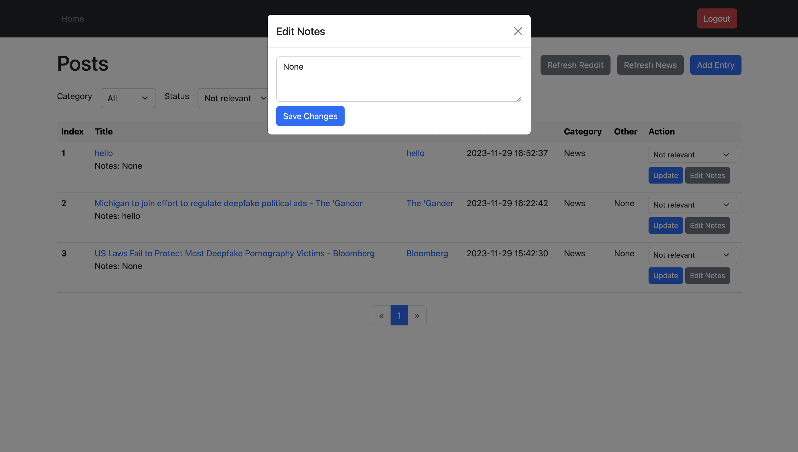

# AI Harms Repository

This is a website built with flask and Bootstrap 5. It uses news and reddit apis to fetch Deepfake-related content for research on AI harms.

## Overview

1. Login page:


2. Fetch new data from api endpoint again:


3. Mannually add entries:


4. Edit notes of entries:



5. Filter contents based on criteria with pagination:


## Getting started

1. Create a virtual environment and source it:

   ```
   python -m venv .venv
   source .venv/bin/activate
   source .env
   ```

2. Install packages:

   ```
   pip install -r requirements.txt
   ```

3. Running:

   ```
   python manage.py run
   ```

## Notes

User authentication is implemented based on [tutorial](https://www.freecodecamp.org/news/how-to-setup-user-authentication-in-flask/) by Ashutosh Krishna.
